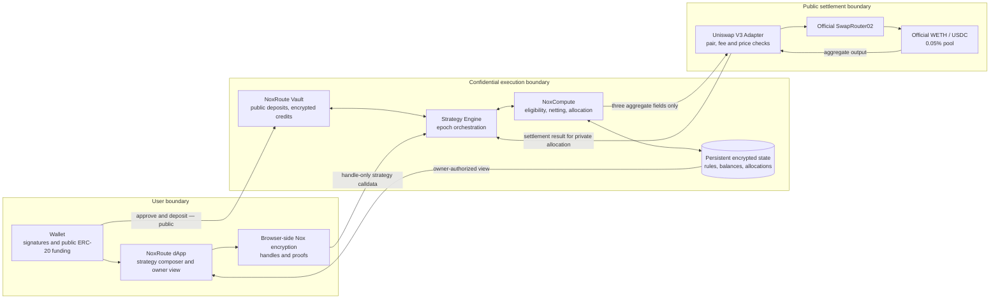
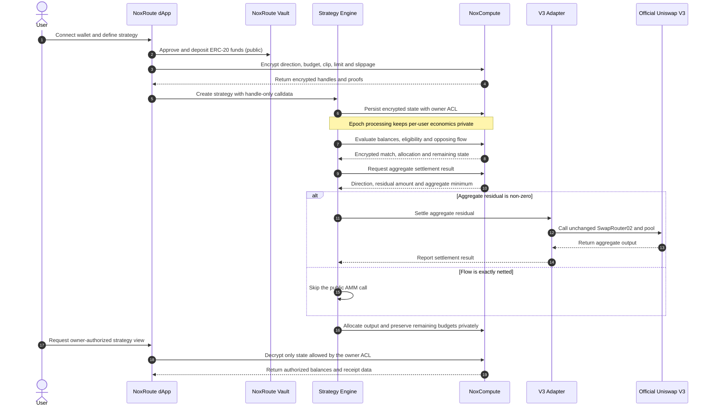

<p align="center">
  
</p>

<h1 align="center">NoxRoute</h1>

<p align="center">
  <strong>Confidential recurring execution for public Uniswap markets.</strong>
</p>

<p align="center">
  NoxRoute keeps strategy economics encrypted across epochs, privately nets opposing flow,
  and sends only an unmatched aggregate residual to the official Uniswap V3 settlement path.
</p>

<p align="center">
  <a href="https://noxroute.vercel.app"></a>
  
  
  
</p>

<p align="center">
  <a href="https://noxroute.vercel.app">Open the dApp</a>
  ·
  <a href="SUBMISSION.md">Submission brief</a>
  ·
  <a href="evidence/README.md">Evidence ledger</a>
  ·
  <a href="demo-script.md">Demo script</a>
</p>

> [!IMPORTANT]
> NoxRoute is testnet software. It is not mainnet-audited or production-ready.
> Use Sepolia test assets only.

## The idea

A recurring swap is more revealing than a single trade. Repeated public
transactions can expose a wallet's direction, budget, clip size, limit,
slippage tolerance, cadence, and remaining capital. Even when each trade looks
ordinary on its own, the sequence becomes a readable strategy.

NoxRoute adds a confidential execution layer without changing Uniswap. A user
funds a public ERC-20 vault, encrypts the strategy rules in the browser, and
submits Nox handles instead of plaintext strategy values. Nox maintains the
private state across epochs, decides which clips are eligible, matches opposing
WETH/USDC flow, and allocates the result. If the batch is not perfectly
balanced, only the unmatched aggregate residual is routed through the official
Uniswap V3 contracts on Sepolia.

The result is composable public settlement with a much smaller disclosure
surface: Uniswap remains transparent and unmodified, while the strategy that
decides when and how to use it does not become public calldata.

### At a glance

| | |
|---|---|
| **Product** | Confidential recurring WETH/USDC strategy execution |
| **Confidential compute** | iExec Nox encrypted handles, ACLs, and private computation |
| **Public settlement** | Official Uniswap V3 `SwapRouter02` and WETH/USDC 0.05% pool |
| **Network** | Ethereum Sepolia (`11155111`) |
| **Epoch cadence** | 5 minutes |
| **Current capacity** | Up to 8 active strategies per epoch |
| **Live dApp** | [noxroute.vercel.app](https://noxroute.vercel.app) |
| **Evidence status** | Local Nox, browser UI, MetaMask flow, and multi-wallet Sepolia E2E recorded |

## Why Nox is load-bearing

1. **Persistent private strategy state across epochs** — Direction, budget,
   clip size, limits, slippage, and remaining state can survive from one epoch
   to the next without being republished as plaintext.
2. **Encrypted balance sufficiency and clip eligibility** — Nox checks whether
   a strategy can participate and selects an eligible clip without exposing a
   user's balance sufficiency or rejection reason.
3. **Confidential opposing-flow netting** — Eligible WETH-to-USDC and
   USDC-to-WETH flow is compared and matched before any public AMM call.
4. **Private post-settlement allocation and remaining balances** — Outputs are
   assigned to encrypted owner balances and unused budgets remain confidential
   for later epochs.

These are separate jobs in the execution path, not a single encryption call at
the edge. Removing Nox from any one of them either exposes per-user strategy
economics or reduces the product to a one-shot public batch. Nox is therefore
both the state boundary and the computation boundary of NoxRoute.

## Architecture



The vault, engine, and adapter are project contracts. NoxCompute provides the
confidential execution boundary. The router and pool are existing Uniswap V3
contracts; NoxRoute does not modify their interfaces or bytecode.

## Execution lifecycle



## Privacy boundary

NoxRoute narrows execution disclosure; it does not make the surrounding chain
activity invisible.

| Boundary | Information |
|---|---|
| **Public by design** | ERC-20 approvals, deposits, withdrawals, wallet addresses, lifecycle timing, participant count, contract calls, and any residual Uniswap settlement |
| **Private with Nox** | Direction, budget, clip, limit, slippage, eligibility, requested and matched volume, rejection reason, per-user allocation, and remaining balances |
| **Selectively revealed for settlement** | Aggregate residual direction, aggregate residual amount, and aggregate minimum output |

An authorized participant can compare **viewer-authorized requested and matched
volume**. Ordinary chain observers see **only the aggregate public residual**.
At finalization there are **exactly three aggregate public decryptions**:
`residualDirection`, `residualAmount`, and `aggregateMinOut`.

Those three values are sufficient for public settlement. Clips, limits,
slippage, eligibility, balances, allocations, requested volume, matched volume,
and remaining state stay behind viewer-specific ACLs.

## Measured disclosure reduction on Sepolia

The recorded two-owner E2E normalizes both sides of the WETH/USDC batch into
quote-WAD accounting. The result is a concrete disclosure measurement from one
testnet run:

| Recorded value | Quote-normalized amount | Interpretation |
|---|---:|---|
| Total requested flow | `20.4876839905` | Combined eligible flow across both directions |
| Internally matched flow, per side | `8.436105` | Equal opposing volume matched without becoming external AMM input |
| Net aggregate residual | `3.6154739905` | Requested flow minus twice the matched amount |
| Residual used for settlement | `3.615473990499990936` | Public settlement amount after unit conversion and rounding |
| Rounding dust | `0.000000000000009064` | Difference between the normalized net residual and settlement residual |

In this run, `20.4876839905 − (2 × 8.436105) = 3.6154739905`, so roughly
**82.35% of the quote-normalized requested flow was internally matched** before
the public AMM path. This figure is derived from the recorded artifact and
describes disclosure reduction for this run. It is not an anonymity result,
liquidity benchmark, price-improvement claim, or mainnet performance forecast.

Source: [`evidence/sepolia-e2e-v3.json`](evidence/sepolia-e2e-v3.json).

## Deployed system

The current V3 deployment is pinned to Ethereum Sepolia and one WETH/USDC fee
tier. All links below come from
[`dapp/v3-deployment.json`](dapp/v3-deployment.json).

| Component | Responsibility | Sepolia address |
|---|---|---|
| NoxCompute | Confidential handle operations and computation | [`0x24Ef…F77bF`](https://sepolia.etherscan.io/address/0x24Ef36Ec5b626D7DCD09a98F3083c2758F0F77bF) |
| NoxRoute Vault | Public token custody boundary and encrypted owner credits | [`0x7ac5…990f6`](https://sepolia.etherscan.io/address/0x7ac57676aF7810358Db8a09fe0bc51C6559990f6) |
| Strategy Engine | Persistent strategies, epochs, Nox orchestration, and allocation | [`0x8Ff5…33251`](https://sepolia.etherscan.io/address/0x8Ff54Fbf497D48bCFba47Dd2bD36aC0F83233251) |
| Uniswap V3 Adapter | Pair, fee, TWAP, deviation, and aggregate settlement checks | [`0xed8d…50aD2`](https://sepolia.etherscan.io/address/0xed8d65bfE6b170C431A353fD74e205a1BfB50aD2) |
| WETH | Official Sepolia wrapped ether used by the configured market | [`0xfFf9…6B14`](https://sepolia.etherscan.io/address/0xfFf9976782d46CC05630D1f6eBAb18b2324d6B14) |
| USDC | Official Sepolia USDC used by the configured market | [`0x1c7D…7238`](https://sepolia.etherscan.io/address/0x1c7D4B196Cb0C7B01d743Fbc6116a902379C7238) |
| Uniswap V3 Factory | Resolves and validates the configured pool | [`0x0227…aC1c`](https://sepolia.etherscan.io/address/0x0227628f3F023bb0B980b67D528571c95c6DaC1c) |
| WETH/USDC 0.05% pool | Official public market used for aggregate residuals | [`0x3289…EfF1`](https://sepolia.etherscan.io/address/0x3289680dD4d6C10bb19b899729cda5eEF58AEfF1) |
| SwapRouter02 | Unchanged official Uniswap V3 settlement interface | [`0x3bFA…e48E`](https://sepolia.etherscan.io/address/0x3bFA4769FB09eefC5a80d6E87c3B9C650f7Ae48E) |

### Deployment profile

| Parameter | Value |
|---|---:|
| Chain ID | `11155111` |
| Pool fee | `500` / 0.05% |
| TWAP window | 300 seconds |
| Maximum price deviation | 100 bps |
| Epoch duration | 300 seconds |
| Maximum active strategies | 8 |
| Deployment verification block | `11391894` |

Dependency bytecode, token metadata, pool configuration, and pool state are
recorded in
[`evidence/v3-sepolia-dependencies.json`](evidence/v3-sepolia-dependencies.json).

## Real Sepolia E2E

The multi-wallet run used two independent owners, two encrypted strategies, a
confidential epoch, aggregate proof finalization, and a real residual settlement
through the configured official Uniswap V3 pool.

| Stage | Transaction |
|---|---|
| WETH-owner encrypted strategy | [`0xc990…0864`](https://sepolia.etherscan.io/tx/0xc990e3fc04394fa6956450a7b3df5918517ee1cd6bea389778534b505c4d0864) |
| USDC-owner encrypted strategy | [`0xd8b6…855d`](https://sepolia.etherscan.io/tx/0xd8b658b3fe45635978d87d84670b5e9e54e720a5f8ce7e3b2ea4b98e0676855d) |
| Confidential epoch lock and netting | [`0xea3a…ce22`](https://sepolia.etherscan.io/tx/0xea3ad346a980483d10c6d147fcbd9fc881e9214516b3bc3f77fd22a702d3ce22) |
| Aggregate proof finalization | [`0xd395…5770`](https://sepolia.etherscan.io/tx/0xd395fe536c1482a29f42fb924c7346ed578345a63e9e2a98a9ea426bce5a5770) |
| Official Uniswap residual settlement | [`0xb7f3…125a`](https://sepolia.etherscan.io/tx/0xb7f3d0129bafd9eb2e3a9210f54d2a1bdca4844b3c3768d81b54e9863adb125a) |

The settled epoch is
[`0x68984849…75802`](https://sepolia.etherscan.io/tx/0xea3ad346a980483d10c6d147fcbd9fc881e9214516b3bc3f77fd22a702d3ce22)
(`0x68984849f6fcfb04e1772dcdb1352d93d1f6569d034b9f8632fa9cd9cc375802`).
The evidence records an official pool log, owner-authorized post-settlement
decryption, rejected unauthorized decryption, and rejected proof replay.

### Evidence levels

Each artifact proves a different layer. The labels below intentionally keep
those boundaries separate.

- Real multi-wallet Sepolia E2E: **verified** —
  [`evidence/sepolia-e2e-v3.json`](evidence/sepolia-e2e-v3.json) records the
  two owners, encrypted strategies, private netting, three aggregate
  decryptions, official residual settlement, owner reads, and rejection checks.
  It does not prove mainnet safety.
- MetaMask connection lifecycle: **verified** —
  [`evidence/extension-wallet-smoke-2026-08-01.md`](evidence/extension-wallet-smoke-2026-08-01.md)
  records real EIP-6963 wallet discovery, connect, refresh persistence, account
  menu, disconnect, and reconnect. It is distinct from a headless wallet mock.
- Token-funded extension transactions: **verified** —
  [`evidence/extension-wallet-strategy-2026-08-01.json`](evidence/extension-wallet-strategy-2026-08-01.json)
  records real MetaMask approval, vault deposit, handle-only strategy creation,
  owner-authorized reveal, epoch lock, proof finalization, and Uniswap residual
  settlement. It does not prove production readiness.
- Public Vercel dApp: **verified** —
  [`evidence/vercel-deployment-2026-08-02.md`](evidence/vercel-deployment-2026-08-02.md)
  records the public production URL, asset checks, and a browser smoke test. It
  does not by itself prove extension signing or on-chain settlement.

The complete claim-to-artifact matrix is maintained in
[`evidence/README.md`](evidence/README.md).

## Run locally

### Prerequisites

- Node.js 22 or newer; the current workspace was verified with Node.js 24.
- npm.
- PowerShell for the commands below.
- WSL for the containerized local Nox stack.
- A browser wallet on Sepolia only if you want to use the interactive dApp.

### Install, compile, and test

```powershell
cd D:\dorahack\ixec\projects\nox-batch
npm install
npm run build
npm run test:unit:v3
npm run typecheck
npm run docs:check:v3
```

### Start the dApp

```powershell
npm run dapp
```

Open [http://localhost:5173](http://localhost:5173). The dApp explains the
public ERC-20 deposit boundary before approval. Use Sepolia test assets only.

### Additional verification

```powershell
# Runs against the local Nox stack through WSL
npm run test:nox:local:v3

# Runs the Playwright browser suite
npm run test:browser:v3

# Reads and checks deployed Sepolia dependencies; requires network access
npm run verify:v3:sepolia

# Reconciles the saved E2E artifact with the configured deployment
npm run verify:e2e:v3
```

The state-changing Sepolia E2E is intentionally not part of the default setup
path. It requires funded test wallets and explicit operator intent.

## Repository map

```text
projects/nox-batch/
├── contracts/v3/       V3 vault, strategy engine, adapter, interfaces and math
├── dapp/                Static NoxRoute application and deployment metadata
├── e2e/                 Local-Nox and Sepolia end-to-end specifications
├── evidence/            Machine-readable proof, screenshots and claim ledger
├── scripts/             Deployment, dependency checks and evidence reconciliation
├── test/                Solidity, privacy, documentation and browser tests
├── PRIVACY.md           Public/private/selectively revealed data model
├── SECURITY.md          Threat model, trust assumptions and known limitations
├── SUBMISSION.md        Claim-safe hackathon submission copy
└── demo-script.md       Four-minute evidence-first demonstration
```

Legacy source filenames remain in parts of the contract history because they
identify already deployed artifacts. NoxRoute is the public product name used
by the dApp and submission documentation.

## Why this fits the challenge

NoxRoute integrates privacy into an existing open-source protocol without
requiring changes to that protocol. Nox handles the confidential strategy
state, eligibility, matching, and allocation. Uniswap V3 keeps its normal,
transparent contracts and composable interfaces. The integration boundary is
the aggregate residual: only the amount that still needs public liquidity is
sent to the official router and pool.

That makes Nox useful for more than hiding an input field. It changes what the
public market needs to learn, while preserving the settlement infrastructure
other applications already know how to compose with.

## Security model and limitations

- **Deposits and withdrawals are public. Addresses and lifecycle timing are public.**
  ERC-20 approvals, participant count, contract calls, and any
  residual settlement can also be observed and correlated.
- Confidentiality depends on **TEE/Nox trust**, correct viewer ACLs, correct
  contract integration, wallet behavior, and the surrounding Ethereum and
  Uniswap security models.
- The current Sepolia deployment supports **one WETH/USDC pair**, **one 0.05% fee tier**, a **maximum of 8 strategies**, and a **fixed cadence**.
- NoxRoute is **not an anonymity system**. It does not hide wallet identity,
  funding, withdrawal, or timing metadata.
- NoxRoute is **not mainnet-audited** and **not production-ready**. Do not use
  assets with real economic value.
- Sepolia test pool price and liquidity are **not market-quality evidence** and
  must not be treated as proof of execution quality, price improvement, or
  scalable liquidity.

Read [`SECURITY.md`](SECURITY.md) and [`PRIVACY.md`](PRIVACY.md) before using
the test deployment.

## Current scope and next hardening steps

The repository demonstrates a complete Sepolia product path for one fixed
market. Moving beyond a hackathon-grade testnet deployment would require:

- independent contract and privacy-boundary audits;
- stronger liveness, keeper, retry, and recovery guarantees;
- formal verification of ACL and public-decryption invariants;
- broader market configuration with safe decimal and liquidity validation;
- production monitoring, incident response, and operator documentation; and
- a fresh deployment rather than relying on the current testnet contracts.

These are roadmap requirements, not completed claims.

## Documentation

| Document | Purpose |
|---|---|
| [`SUBMISSION.md`](SUBMISSION.md) | Concise, claim-safe hackathon submission copy |
| [`demo-script.md`](demo-script.md) | Four-minute evidence-first demo flow |
| [`PRIVACY.md`](PRIVACY.md) | Disclosure map and viewer authorization model |
| [`SECURITY.md`](SECURITY.md) | Trust assumptions, risks, and operational limits |
| [`evidence/README.md`](evidence/README.md) | Claim-to-artifact ledger and stale-claim audit |
| [`dapp/project.json`](dapp/project.json) | Machine-readable product, scope, and evidence metadata |

## Acknowledgements

NoxRoute was built for the iExec **Write The Future** Nox challenge. It uses
iExec Nox for confidential state and computation, Ethereum Sepolia for the
public testnet deployment, and the existing Uniswap V3 contracts for public
liquidity and settlement.

The project deliberately keeps those responsibilities separate: Nox protects
the strategy; Ethereum verifies the public lifecycle; Uniswap settles only the
aggregate residual that still needs an open market.
